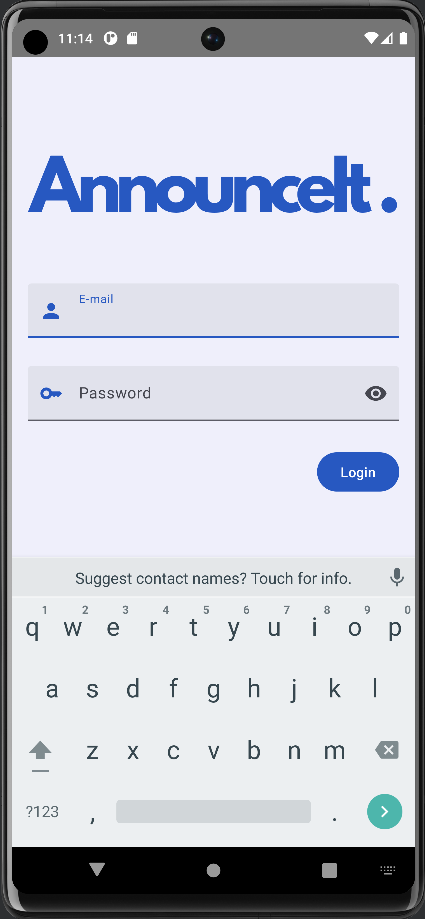
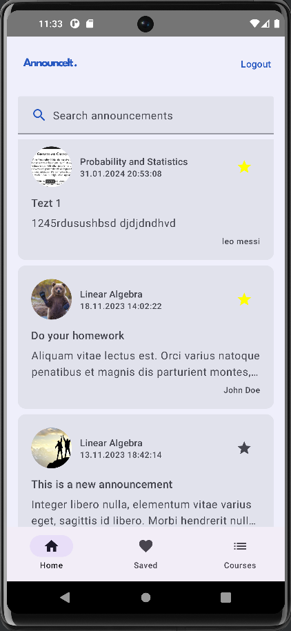
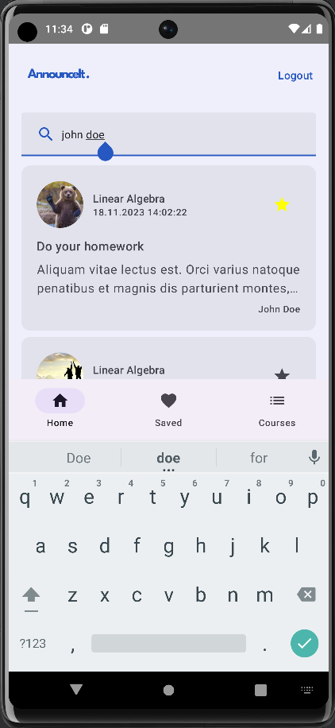
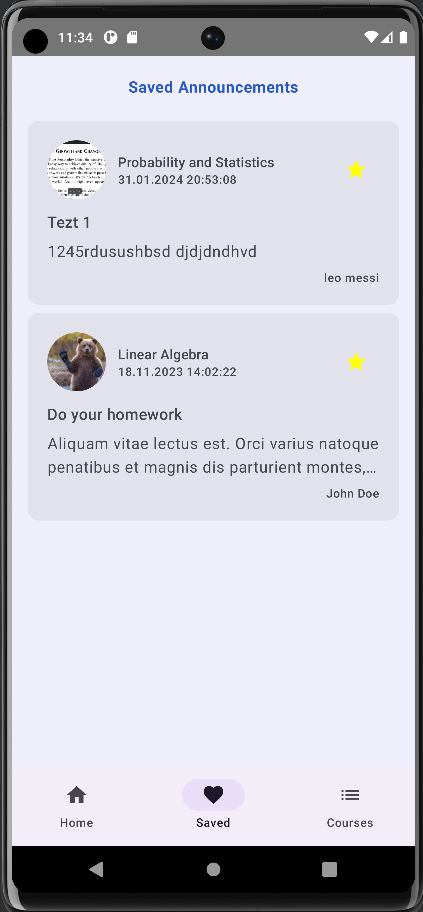
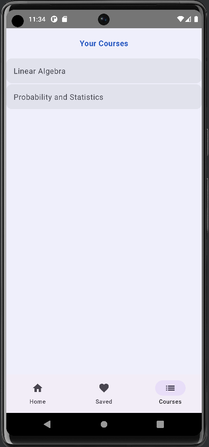
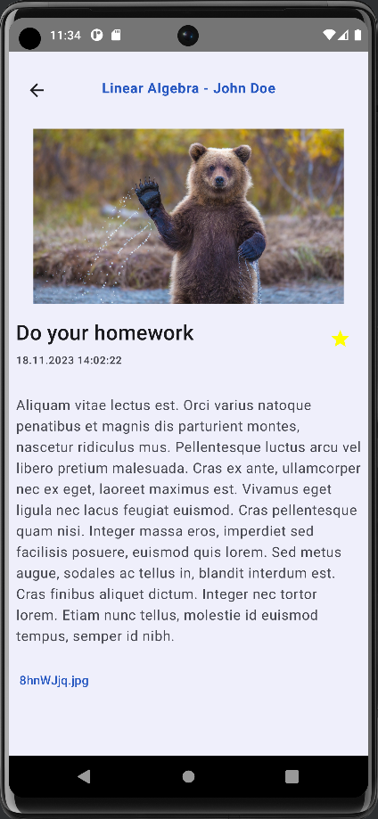
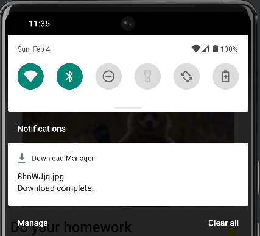
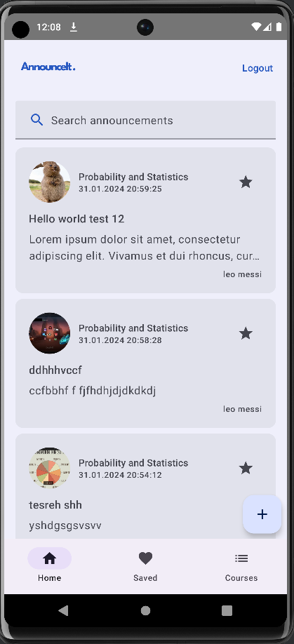
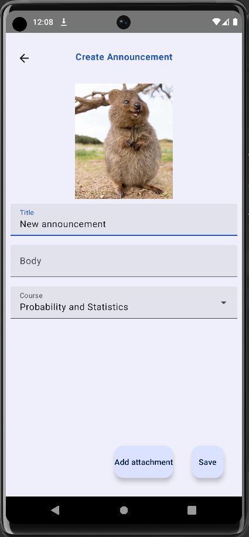
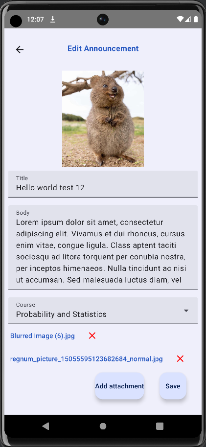

# AnnounceIt

During the time I was studying in the universty each year we had to find and join the telegram channel of each subject and the professors would make different kind of announcements and share files that we need during our studies. I found it not so convenient and thought of an app that keeps the announcements and courses in one place. This is the app!

## If you want to test the app yourself:
**Student** - username=u1810087@student.com password=123456 

**Teacher** - username=l.messi@prof.com password=123456

## Used technologies and libraries:
* **MVVM** architecture
* **Dagger Hilt** for dependency injection
* **Firebase Firestore** for saving and retrieving data online
* **Firebase Storage** - online storage for uploading into and loading files from
* **DownloadManager** to download files from the internet
* **Retrofit** for http queries
* **Room** for caching data
* **Coroutines** for asynchronous execution of the code
* **Compose** for UI
* **Navigation Compose** for navigation through screens
* **Coil** for loading images
* **LiveData** and **Flow** for dynamic retrieval of the data and updating of the screen

## Screenshots with explanation
As you open the app for the first time you'll see an authentication page. There're 2 types of users: student and teachers.

 ### 1. Student
When you login as a student you'll see the latest announcements of the courses that you're in. Also you can search for a specific announcements by their title, content, course name, teacher name and etc.

    
    

You can save announcements by clicking on the star icon and see the saved announcements on the screen below

The third screen shows the courses that the student was enrolled in

In the details screen you see the full details of the announcements and attached files below

As you click on one of the attachments the file will be downloaded and a notification will pop up

### 2. Teacher
The main difference of teacher role from the student role is that teachers can create new announcements and edit the existing announcements that they made.

    
    
    

